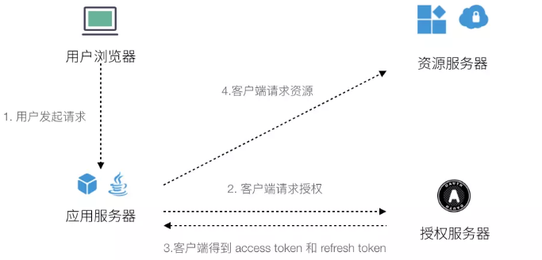
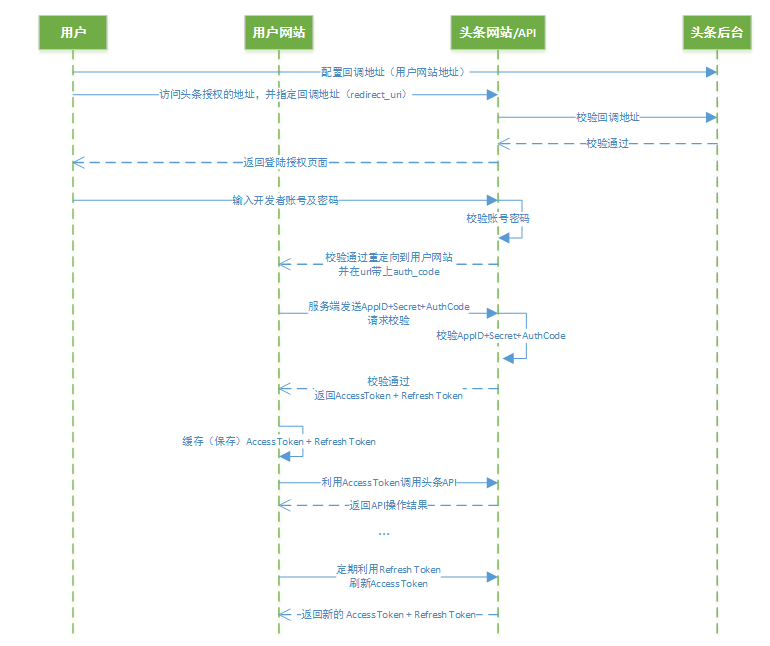

# 前言

> 因公司要求，现在把头条的广告系统也接到手里了。之前一直在维护百度等搜索推广的系统，虽然都是广告营销的平台，但是 API 的接入规则和推广方式等等还是存在挺多不同，特别是头条系统通过OAuth2.0来进行的token获取。

> 本来特别讨厌 OAuth2.0的交互方式 ，觉得特别麻烦。但是看了主流网站和各类应用越来越多的使用OAuth2.0之后。也觉得是时候好好研究一下这个麻烦的东西了。

> 为了以后能不踩雷，决定从头记录下踩雷过程。
> 头条Marketing API开发文档：https://ad.toutiao.com/openapi/doc/index.html

# OAuth2.0

> OAuth是一个关于授权（authorization）的开放网络标准，在全世界得到广泛应用，目前的版本是2.0版

OAuth在"客户端"与"服务提供商"之间，设置了一个授权层（authorization layer）。"客户端"不能直接登录"服务提供商"，只能登录授权层，以此将用户与客户端区分开来。"客户端"登录授权层所用的令牌（token），与用户的密码不同。用户可以在登录的时候，指定授权层令牌的权限范围和有效期。

"客户端"登录授权层以后，"服务提供商"根据令牌的权限范围和有效期，向"客户端"开放用户储存的资料。

简言之：

# 交互图
典型的 OAuth2.0 的授权流程：

# 实现
> 由于精力有限，只放上目前在用的两种语言php 和 python 版本的。

### php
> 之前对结果京东的 jos -api ，也需要通过 OAuth2.0 的认证方式获取token。

~~~ php
<?php
function get_access_token($fullInfo=false) {
    if (file_exists(TOKEN_PATH)) {
        $info = file_get_contents(TOKEN_PATH);
        $data = json_decode($info, true);

        if ($fullInfo) {
            return $data;
        } else {
            return $data['access_token'];
        }
    } else {
        return false;
    }
}
~~~

~~~ php
<?php
require 'conf/config.php';
require 'common/utils.php';

$access_token_info = get_access_token(true);
$refresh_token = $access_token_info['refresh_token'];

$param = array(
    'grant_type'    => 'refresh_token',
    'client_id'     => APP_KEY,
    'client_secret' => APP_SECRET,
    'refresh_token' => $refresh_token,
    'state'         => time()
);

$url = TOKEN_ADDR . http_build_query($param);

echo file_get_contents($url);
~~~

### python
> 选用 python 的原因是因为头条的数据需要生成报表，用 python 的一些库更方便，也很容易接入现在的系统。

~~~ python

~~~

# Q & A

Q：获取的 token 一般为10min ， 24h 和 30d，那如何保存？
A1：考虑使用redis，逻辑：

> 假设access_token和refresh_token存在redis中，同时有多个进程使用API进行数据获取。我们在每次请求前从redis中获取access_token进行请求API，如果出现access_token已经过期的错误，则从redis中在读一遍access_token，如果不一样，说明已经有其他进程调用refresh_token接口更新了token，此时直接使用该access_token即可。如果一样，此时应该调用refresh_token接口获取最新的token，成功则保存token至redis，若返回refresh_token已经过期的错误，则需要重新定向到头条侧的授权页面，进行授权行为。

A2: 同时考虑使用 Cookie ... 总之实现方式有很多，选择适合自己的就好。

