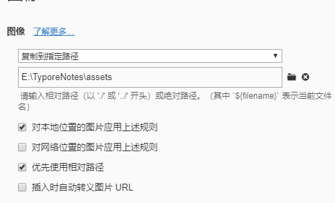
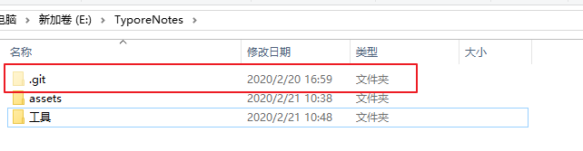
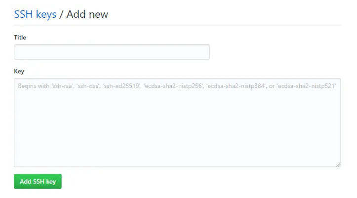

# typora + GitHub 的使用手册 （包括git初始化）

## typora

作为一个程序员来说，没有什么比找到==typora==这一款md编辑器更让人心动的了 :)

但在使用过程中，typora还是有一些缺陷，索性在查阅资料和摸索之后将这些我认为不好用的地方改善了一下，为防止忘记，做一下记录。

##### 1、图片管理

>typora 相较于其他的 md 文件来说，具有图片插入功能让人很是惊喜。但目的既然是为了将物品们的 typora 变成在线笔记来讲，需要将图片放入一个特定的相对目录下，这样方便在 GitHub 上传输和查看，在换成其他的环境之后，也能快速的移植笔记。

- 点击`文件 --> 偏好设置` , 然后找到`图像`，按照下图进行配置

- 然后重启软件即可

## Git & GitHub

> 如果说想要 typora 变成在线模式，那么不妨将我们的笔记放在 GitHub 上面。

- 安装 Git 和在 GitHub 上面申请生成我们的库已略过。
- 在记笔记的文件夹处右键打开 `git bash here`
- 输入 `git init` 便可以看到生成了  `.git`文件夹

- 然后需要配置我们自己的 git username 和 email

- 创建SSH Key。在用户主目录下，看看有没有.ssh目录，如果有，再看看这个目录下有没有id_rsa和id_rsa.pub这两个文件，如果已经有了，可直接跳到下一步。如果没有，打开Shell（Windows下打开Git Bash），创建SSH Key：
~~~nginx
 ssh-keygen -t rsa -C "youremail@example.com"
~~~

- 然后一路回车即可。如果一切顺利的话，可以在用户主目录里找到.ssh目录，里面有id_rsa和id_rsa.pub两个文件，这两个就是SSH Key的秘钥对，id_rsa是私钥，不能泄露出去，id_rsa.pub是公钥，可以放心地告诉任何人。
打开id_rsa.pub,复制里面的内容。

- 登陆GitHub，打开“Account settings”，“SSH Keys and GPG keys”页面：
然后，点“New SSH Key”，填上任意Title，在Key文本框里粘贴id_rsa.pub文件的内容即可。

- 为什么GitHub需要SSH Key呢？因为GitHub需要识别出你推送的提交确实是你推送的，而不是别人冒充的，而Git支持SSH协议，所以，GitHub只要知道了你的公钥，就可以确认只有你自己才能推送。
当然，GitHub允许你添加多个Key。假定你有若干电脑，你一会儿在公司提交，一会儿在家里提   交，只要把每台电脑的Key都添加到GitHub，就可以在每台电脑上往GitHub推送了。

- 做完上面的操作之后就可以将本次和远程仓库连接起来了

~~~nginx
git remote add origin git@github.com:MachinePlay/Gittest.git
~~~

- 然后就是正常的 add.  pull  push 啦。为了方便使用，可以做成如下两个脚本。

~~~shell
#pull 脚本
#!/bin/bash
# 上面中的 #! 是一种约定标记, 它可以告诉系统这个脚本需要什么样的解释器来执行;

git pull origin master
~~~

~~~shell
#!/bin/bash
# 上面中的 #! 是一种约定标记, 它可以告诉系统这个脚本需要什么样的解释器来执行;

echo "放弃有道云的利器 GitAutoPush Starting..."
time=$(date "+%Y-%m-%d %H:%M:%S")
git add .

read -t 30 -p "请输入提交注释:" msg

if  [ ! "$msg" ] ;then
    echo "[commit message] 默认提交, 提交人: $(whoami), 提交时间: ${time}"
	git commit -m "默认提交, 提交人: $(whoami), 提交时间: ${time}"
else
    echo "[commit message] $msg, 提交人: $(whoami), 提交时间: ${time}"
	git commit -m "$msg, 提交人: $(whoami), 提交时间: ${time}"
fi

	
git push origin master
~~~
