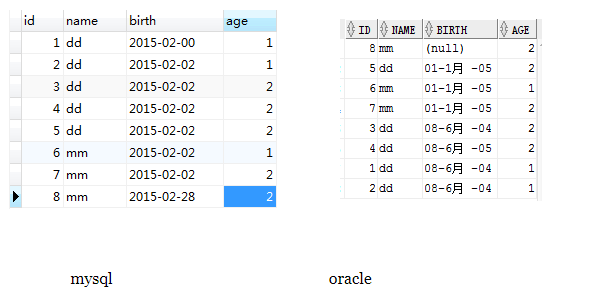
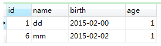
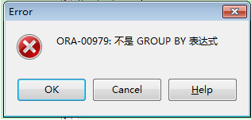

# GROUP BY的用法

>  之前工作的中心基本都放在Mysql上面，对于Oracle数据库用的和研究的确实少之又少。这两天忽然天上派来一个任务，是用Oracle数据库导一些数据出来，没想到因为小小的GROUP BY的用法差异就浪费了我一下午的时间去研究，所以做完事情之后就赶紧备忘一下。

###  前言

group by做为分组来使用，后面为条件，可以有多个条件，条件相同的为一组，配合聚合函数进行相关统计。在不同数据库中用法稍有不同，这里只测试mysql和Oracle。

### 准备工作

为两个数据库都准备一张表。

### 简单的测试对比

~~~mysql
SELECT * FROM PERSON GROUP BY 'name'
~~~

执行结果如下：

mysql ：

Oracle：

### 分析

Oracle 显示==select查询的字段未包含在group by的条件中== 。那么推测：首先通过select * from person可以看到oracle中id并不是升序，或者说没有默认升序。也就是查询的结果是不确定的，hash?这可能涉及到在磁盘的存储等等，这里不去深究。因此，并不能确认第一次查出来的字段的值，而且分组后不是条件的值被合并后没有意义。

然而Mysql并不会去这样判断，就如同上图所示，Mysql只基于GROUP BY的条件去判断，很可能得到的不是我们想要的结果，所以可能并不严谨。

### 总结

Mysql没什么好说的。建议还是依照Oracle的规则来思考问题，写自己的SQL语句。

Oracle的规则如下：
> select 列表项中不存在的列可以出现在group by的列表项中，但反过来就不行了，在select列表项中出现的列必须全部出现在group by后面(聚合函数除外)

### HAVING
HAVING一般都是和GROUP BY 一起用, 用来过滤由GROUP BY语句返回的记录集。

“Where” 是一个约束声明，是在查询结果集返回之前约束来自数据库的数据，且==Where中不能使用聚合函数==。
“Having”是一个过滤声明，是在查询结果集返回以后对查询结果进行的过滤操作，在==Having中可以使用聚合函数==。

