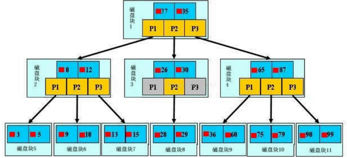

### 什么是索引

>MySQL官方对索引的定义为：索引(Index)是帮助MySQL高效获取数据的数据结构。我们可以简单理解为：快速查找排好序的一种数据结构。Mysql索引主要有两种结构：B+Tree索引和Hash索引。我们平常所说的索引，如果没有特别指明，一般都是指B树结构组织的索引(B+Tree索引)。索引如图所示：

>最外层浅蓝色磁盘块1里有数据17、35（深蓝色）和指针P1、P2、P3（黄色）。P1指针表示小于17的磁盘块，P2是在17-35之间，P3指向大于35的磁盘块。真实数据存在于子叶节点也就是最底下的一层3、5、9、10、13......非叶子节点不存储真实的数据，只存储指引搜索方向的数据项，如17、35。

>查找过程：例如搜索28数据项，首先加载磁盘块1到内存中，发生一次I/O，用二分查找确定在P2指针。接着发现28在26和30之间，通过P2指针的地址加载磁盘块3到内存，发生第二次I/O。用同样的方式找到磁盘块8，发生第三次I/O。

>真实的情况是，上面3层的B+Tree可以表示上百万的数据，上百万的数据只发生了三次I/O而不是上百万次I/O，时间提升是巨大的。

### 索引类型

MYSQL目前有如下几种类型的索引：FULLTEXT， HASH， BTREE， RTREE。

**1. FULLTEXT**
>即为全文索引，目前只有MyISAM引擎支持。其可以在CREATE TABLE ，ALTER TABLE ，CREATE INDEX 使用，不过目前只有 CHAR、VARCHAR ，TEXT 列上可以创建全文索引。
全文索引并不是和MyISAM一起诞生的，它的出现是为了解决WHERE name LIKE “%word%"这类针对文本的模糊查询效率较低的问题。

**2. HASH**
>由于HASH的唯一（几乎100%的唯一）及类似键值对的形式，很适合作为索引。HASH索引可以一次定位，不需要像树形索引那样逐层查找,因此具有极高的效率。但是，这种高效是有条件的，即只在“=”和“in”条件下高效，对于范围查询、排序及组合索引仍然效率不高。

**3. BTREE**
>BTREE索引就是一种将索引值按一定的算法，存入一个树形的数据结构中（二叉树），每次查询都是从树的入口root开始，依次遍历node，获取leaf。这是MySQL里默认和最常用的索引类型。

**4. RTREET**
>RTREE在MySQL很少使用，仅支持geometry数据类型，支持该类型的存储引擎只有MyISAM、BDb、InnoDb、NDb、Archive几种。
相对于BTREE，RTREE的优势在于范围查找。

### 索引种类

普通索引：仅加速查询

唯一索引：加速查询 + 列值唯一（可以有null）

主键索引：加速查询 + 列值唯一（不可以有null）+ 表中只有一个

组合索引：多列值组成一个索引，专门用于组合搜索，其效率大于索引合并

全文索引：对文本的内容进行分词，进行搜索

### 操作索引

1. 创建索引
~~~mysql
--创建普通索引
CREATE INDEX index_name ON table_name(col_name);
--创建唯一索引
CREATE UNIQUE INDEX index_name ON table_name(col_name);
--创建普通组合索引
CREATE INDEX index_name ON table_name(col_name_1,col_name_2);
--创建唯一组合索引
CREATE UNIQUE INDEX index_name ON table_name(col_name_1,col_name_2);
~~~
2. 通过修改表结构创建索引
~~~mysql
ALTER TABLE table_name ADD INDEX index_name(col_name);
~~~
3. 创建表时直接指定索引
~~~mysql
CREATE TABLE table_name (
    ID INT NOT NULL,col_name VARCHAR (16) NOT NULL,INDEX index_name (col_name)
);
~~~
4. 删除索引
~~~mysql
--直接删除索引
DROP INDEX index_name ON table_name;
--修改表结构删除索引
ALTER TABLE table_name DROP INDEX index_name;
~~~
5. 其它相关命令
~~~mysql
- 查看表结构    
desc table_name; 
- 查看生成表的SQL   
show create table table_name;
- 查看索引    
show index from  table_name; 
- 查看执行时间    
set profiling = 1;    
SQL...    show profiles;
~~~

### 创建索引的时机
一般来说，在WHERE和JOIN中出现的列需要建立索引，但也不完全如此，因为MySQL只对<，<=，=，>，>=，BETWEEN，IN，以及某些时候的LIKE才会使用索引。例如：
~~~mysql
SELECT t.Name  FROM mytable_t LEFT JOIN mytable_m ON t.Name=m.username WHERE m.age=20 AND m.city='北京' ;
~~~
此时就需要对city和age建立索引，由于mytable_m表的userame也出现在了JOIN子句中，也有对它建立索引的必要。只有某些时候的LIKE才需建立索引。