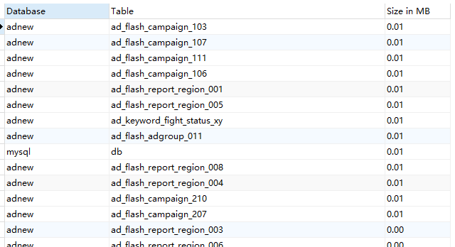

# 数据库内存释放

> 一直维护的数据库表的数量很多，每天都至少好几百万条数据流动。随着需求的增加，之前分配的 2 T 内存马上就要用完了，急需优化数据库，释放内存。以后可能还会出现这样的情况，所以做一个记录。

> 根据搜索资料来看  , 大家常用的解决方法无非是分为两大类 : 转移部分数据和清理日志文件,所以这次优化就围绕这两大类作为尝试

#### 转移数据

首先应该考虑是否因为用不到的数据太多或是日志保留太多。所以首先建议先列出各个表的大小并排序。命令如下：

首先应先进入  ==information_schema== 这个库。然后新建查询

输入查询语句

~~~mysql
SELECT
     table_schema as `Database`,
     table_name AS `Table`,
     round(((data_length + index_length) / 1024 / 1024), 2) `Size in MB`
FROM information_schema.TABLES
ORDER BY (data_length + index_length) DESC;
~~~

可得到如下查询结果：

然后就可以根据表的情况和大小选择清理用不到的数据或选择性的优化数据库表

#### 优化数据库

> 如果已经删除了很大一部分内容，但是内存还是被占用很多，这时候就需要考虑是不是因为mysql留下的数据空洞占据了大部分空间，同时也降低了表的扫描效率。

此时就应该考虑使用OPTIMIZE TABLE 来重新利用未使用的空洞，并整理数据文件的碎片。

~~~mysql
OPTIMIZE TABLE XXX
~~~

但有一点需要注意：在剩余空间很少的情况下，此命令可能出现内存不足报错的情况。此时就应该先从数据量较小的表开始优化，逐渐递增。

本人曾优化一个50G大小的表，竟花费了大半天的时间。

如果数据库中的表数目很多 , 不妨考虑写一个脚本文件来自动执行命令。

本次优化900多张表，故写了一个脚本，并将代码命令放在最后。

需注意：磁盘空洞是因为时间久会产生，所以没必要每天都进行清理。每周甚至每个月清理一次效果比较好。

~~~shell
<?php
require 'znzglobal.php';
require 'znzglobal.oracle.php';
require 'znzglobal.mysql2.php';
require 'global2.php';
//require 'znzad.class_2.php';

ini_set('memory_limit', '2048M');
define('CONF_LOG_FILE', 'optimize_table');

$myDB75	= new znzMySql('adst75');
$myDB75->setEncode("utf8");

$tables	= array('ad_keyword_history_005' ,'ad_keyword_history_006' ,'ad_keyword_history_205' ,'ad_keyword_history_003' ,'ad_keyword_history_001' ,'ad_keyword_history_204' ,'ad_keyword_history_107' ,'ad_keyword_history_101' ,'ad_keyword_history_105' ,'ad_keyword_history_207' ,'ad_keyword_history_109' ,'ad_keyword_history_004');

echo $statdate." :\n";

#$state78	= $myDB78->isvalid();
$state75	= $myDB75->isvalid();

while (true) {
	if(!$state75) {
		echo "database not ready, sleep 5 minute\n";
		sleep(300);
		$myDB75->close();
		$myDB75->open();
	} else {
		break;
	}
}

echo "\tbegin insert  (".date('Y-m-d H:i:s').")\n";

	
foreach($tables as $table) {
// 		writeLog(CONF_LOG_FILE, '====== '.$currdate.' '.$accountid.' ======');

	$sql    = "optimize table {$table}";
	writeLog(CONF_LOG_FILE, 'MYSQL75:'.$sql);
	$ret	= $myDB75->get($sql);
	writeLog(CONF_LOG_FILE, 'ret:'.json_encode($ret));
	if(is_array($ret) && count($ret)>0) {
		$cnt1	= $ret[0]['cnt'];
	}
	$myDB75->close();
}

writeLog(CONF_LOG_FILE, 'DONE');

function writeLog($filename, $str, $data=1){
	echo date('Y-m-d H:i:s(D): ').$str."\n";
	znz_log("/var/log/ad/".$filename, $str, $data);
}
~~~

